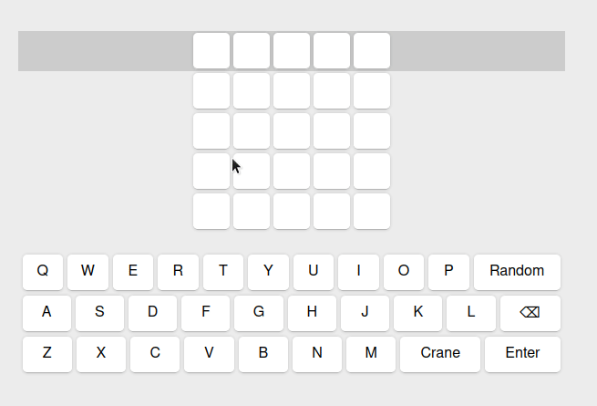
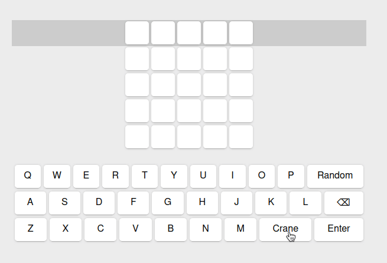

# Create your own wordle clone in React.js



In this tutorial you're going to learn some React.js basics by creating the popular game wordle.

- [Create your own wordle clone in React.js](#create-your-own-wordle-clone-inreactjs)
  - [Project setup](#project-setup)
  - [Displaying rows](#displaying-rows)
  - [Displaying the keyboard](#displaying-the-keyboard)
  - [State](#state)
  - [Validation](#validation)
  - [Goal to guess](#goal-to-guess)
  - [Win detection](#win-detection)
  - [Improvements](#improvements)
  - [Check out the source code](#check-out-the-source-code)

## Project setup

To setup a React.js project make sure you have node.js installed on your device. Then run

```bash
npx create-react-app my-app
```

in an terminal. In the directory `my-app` run:

```bash
npm run start
```

to start the application with hot reload at `http://localhost:3000/`. Hot reload means when you update your code the website will automatically update too.

Let's start working on the game. In `src/App.js` we can delete the default html elements and replace them with our wordle board. So all we have left for now is:

```js
import "./App.css";

function App() {
  return <div className="App"></div>;
}

export default App;
```

As you can see, in react we simply export a function using the `export default` keywords and the function exports html. And we can write the html code directly into our javascript function. And in this html we can use variables and function that got declared inside the function or got imported into the scope. That is what makes React.js so powerful.

## Displaying rows

We will simply create two new functions. The first one will represent a row and the second one will represent a single cell.


```js
function Row() {
  return (
    <div className="row">
      <Cell />
      <Cell />
      <Cell />
      <Cell />
      <Cell />
    </div>
  );
}

function Cell() {
  return <div className="cell"></div>;
}
```

As you can see we need the attribute `className` instead of `class` in react.

Then we display five of these rows and put them in a wrapper class

```js
import "./App.css";

function App() {
  return (
    <div className="App">
      <div className="App">
        <div className="wrapper">
          <div className="field">
            <Row />
            <Row />
            <Row />
            <Row />
            <Row />
          </div>
        </div>
      </div>
    </div>
  );
}

function Row() {
  return (
    <div className="row">
      <Cell />
      <Cell />
      <Cell />
      <Cell />
      <Cell />
    </div>
  );
}

function Cell() {
  return <div className="cell"></div>;
}

export default App;
```

And we apply some styling in the `App.css`

```css
.App {
  display: flex;
  justify-content: center;
  align-items: center;

  min-height: 100vh;
  background: #ececec;

  padding: 0;
  margin: 0;
}

.wrapper {
  display: flex;
  flex-direction: column;
  justify-content: center;
  width: 100%;
  max-width: 600px;
}

.wrapper .field {
  margin: 20px 0;
}

.wrapper .field .row {
  display: flex;
  justify-content: center;

  width: 100%;
}

.row {
  display: flex;
}

.cell {
  align-items: center;
  background: #fff;
  border-bottom: 1px solid #b5b5b5;
  border-radius: 5px;
  box-shadow: 0 0 3px -1px rgba(0, 0, 0, 0.3);
  box-sizing: border-box;
  display: flex;
  width: 40px;
  height: 40px;
  justify-content: center;
  padding: 5px;
  margin: 2px;
}
```

## Displaying the keyboard

Let's add the keyboard at the bottom. For that we install simple keyboard like that

```bash
npm install react-simple-keyboard --save
```

and import the component as well as the style into the `App.js` and add the keyboard component.

```js
import Keyboard from "react-simple-keyboard";
import "react-simple-keyboard/build/css/index.css";

// ...

<div className="field">
    <Row />
    <Row />
    <Row />
    <Row />
    <Row />
</div>
<div className="keyboard">
    <Keyboard />
</div>

// ...
```

In order to set a custom character set we initialize two objects and pass them as parameters to the keyboard component. We need the layout of the keyboard which contains all characters visible on the keyboard. You can even add some extra characters like a dedicated `crane` button since `3 Blue 1 Brown` broke the game and everyone is using `crane` as their opener.

```js
// will be used for the layout
const keyboardLayout = {
  default: [
    "Q W E R T Y U I O P {crane}",
    "A S D F G H J K L {bksp}",
    "Y X C V B N M {enter}",
  ],
};

// will be used for the name of buttons
const keyboardDisplay = {
  "{rnd}": "Random",
  "{crane}": "Crane",
  "{bksp}": "⌫",
  "{enter}": "Enter",
};

function App() {
  // ...
  <Keyboard layout={keyboardLayout} display={keyboardDisplay} />;
  // ...
}
```

We can use variables for the attribute values by simply wrapping the variable name in curly brackets.

## State

Now lets add state to our project. To do this, we need to understand how react handles state. We want to have a variable called `row` which stores the current row in the wordle game. And we want to display the current row by highlighting it. To do this, we need to create a `state` like this:

```js
const [row, setRow] = useState(0);
```

We can now access the variable row when we want to get the current row of our application and to set the row we need to use the function `setRow()`. This will ensure that the content in our component will get updated. So let's display the current row. For that we add a parameter to the `Row` component called `active` and we'll pass true, if the current row is equals to the row number. We'll also pass a function, that will increment the current row when enter got pressed.

```js
function App() {
  const [row, setRow] = useState(0);

  function keyboardPressed(key) {
    if (key === "{enter}") {
      setRow(row + 1);
      return;
    }
  }

  return (
    <div className="App">
      <div className="App">
        <div className="wrapper">
          <div className="field">
            <Row active={row === 0} />
            <Row active={row === 1} />
            <Row active={row === 2} />
            <Row active={row === 3} />
            <Row active={row === 4} />
          </div>
          <div className="keyboard">
            <Keyboard
              layout={keyboardLayout}
              display={keyboardDisplay}
              onKeyPress={keyboardPressed}
            />
          </div>
        </div>
      </div>
    </div>
  );
}

function Row({ active }) {
  return (
    <div className={`row${active ? " active" : ""}`}>
      <Cell />
      <Cell />
      <Cell />
      <Cell />
      <Cell />
    </div>
  );
}
```

And add the following style

```css
.row.active {
  background: #cccccc;
}
```


Let's add more state to the application: We need the variable `data` which stores all inputted words in an array. And let's add these two helper functions that will help us later dealing with the state.

```js
const [data, setData] = useState(["", "", "", "", "", ""]);

function getCurrentWord() {
  return data[row];
}
function setCurrentWord(word) {
  data[row] = word;
  setData([...data]);
}
```

And let's expand the `keyboardPressed` function too:

```js
function keyboardPressed(key) {
  if (key === "{enter}") {
    setRow(row + 1);
    return;
  }

  if (key === "{crane}") {
    setCurrentWord("Crane");
    return;
  }

  if (key === "{bksp}") {
    if (getCurrentWord().length === 0) return;
    setCurrentWord(getCurrentWord().slice(0, -1) ?? "");
    return;
  }

  if (getCurrentWord().length !== 5) {
    setCurrentWord(getCurrentWord() + key);
  }
}
```

Now we only need to display the information in the fields. To do that we pass in more information to the rows and cells about the data. We'll pass the corresponding data row to each row, then we'll pass the word of a row to each cell and the index of the cell. You'll see why this is helpful later.

```js
<div className="field">
  <Row active={row === 0} word={data[0]} />
  <Row active={row === 1} word={data[1]} />
  <Row active={row === 2} word={data[2]} />
  <Row active={row === 3} word={data[3]} />
  <Row active={row === 4} word={data[4]} />
</div>
```

```js
function Row({ active, word }) {
  return (
    <div className={`row${active ? " active" : ""}`}>
      <Cell word={word} index={0} />
      <Cell word={word} index={1} />
      <Cell word={word} index={2} />
      <Cell word={word} index={3} />
      <Cell word={word} index={4} />
    </div>
  );
}

function Cell({ word, index }) {
  const char = word.charAt(index);
  return <div className="cell">{char}</div>;
}
```


## Validation

We currently can enter any word that we like and also spam the enter key how we like. What we want is that the user can only write words that got listed by us. So we create javascript file that exports all words. I just got a little bit inspired by the original wordle dictionary ;). Let's call this file `words.js`

```js
export default [
  "CIGAR",
  "REBUT",
  "SISSY",
  "HUMPH",
  "AWAKE",
  "BLUSH",
  "FOCAL",
  // ...
];
```

Now we can easily import our words like that:

```js
import words from "./words";
```

and validate our world like that

```js
if (key === "{enter}") {
  if (words.includes(getCurrentWord())) {
    setRow(row + 1);
  } else {
    // an invalid word got entered
  }
  return;
}
```

## Goal to guess

We now need a word to guess. Let's use a state for that and pick one randomly.

```js
function getRandomWord() {
  return words[Math.floor(Math.random() * words.length)];
}
```

```js
const [wordToGuess, setWordToGuess] = useState(getRandomWord());
```

We can now also add the implementation for the `Random` button:

```js
if (key === "{rnd}") {
  setCurrentWord(getRandomWord());
  return;
}
```

To show the user feedback about their input we need to pass the `wordToGuess` to the rows and cells

```js
function Row({ wordToGuess, active, word }) {
  /* ... */
}
```

And in the cell component we'll check for the status of the word by comparing the input to the `wordToGuess`. When the character is equals to the character in the `wordToGuess` at the same position, the input is `correct`. If the `wordToGuess` includes the character the input is `present`. Else the input is `not-found`.

```js
function Cell({ wordToGuess, word, index }) {
  const char = word.charAt(index);

  let className = "cell";

  if (wordToGuess != null) {
    if (wordToGuess.charAt(index) === char) {
      className += " correct";
    } else if (wordToGuess.includes(char)) {
      className += " present";
    } else {
      className += " not-found";
    }
  }

  return <div className={className}>{char}</div>;
}
```

Thats actually a little bit different from the original game but since this is a clone we can make our own rules.

We need to add some style classes for the states. I again got inspired by something called tailwind.

```css
.correct {
  background: #4ade80 !important;
}

.present {
  background: #fbbf24 !important;
}

.not-found {
  background: #cccccc !important;
}
```

The only problem is that we can see which field is correct the moment we input it. We should only be able to see it after we pressed on enter.


To fix that let's make sure to only pass in the word to guess to a row when the current row is larger.

```js
<Row wordToGuess={row > 0 ? wordToGuess : null} active={row === 0} word={data[0]} />
<Row wordToGuess={row > 1 ? wordToGuess : null} active={row === 1} word={data[1]} />
<Row wordToGuess={row > 2 ? wordToGuess : null} active={row === 2} word={data[2]} />
<Row wordToGuess={row > 3 ? wordToGuess : null} active={row === 3} word={data[3]} />
<Row wordToGuess={row > 4 ? wordToGuess : null} active={row === 4} word={data[4]} />
```

In the original, the keyboard gets highlighted as well which helps a lot with finding the right word. To implement that, we need to pass in a `buttonTheme` to the `Keyboard` component.

```js
function getDefaultButtonTheme() {
  return [
    {
      class: "correct",
      // use space separated keyboard characters
      // e.g. buttons: "C R A N E",
      buttons: "",
    },
    {
      class: "present",
      buttons: "",
    },
    {
      class: "not-found",
      buttons: "",
    },
  ];
}

const [buttonTheme, setButtonTheme] = useState(getDefaultButtonTheme());
```

```html
<Keyboard
  layout="{keyboardLayout}"
  display="{keyboardDisplay}"
  onKeyPress="{keyboardPressed}"
  buttonTheme="{buttonTheme}"
>
  {JSON.stringify(buttonTheme)}
</Keyboard>
```

You may be noticing that we insert the button theme as text into the component. This is a little hack which forces the keyboard component to rerender. Usually it won't rerender automatically which is an issue with the keyboard component.

So now all thats left to do is to update the button theme when enter got pressed. We basically iterate over all characters and add collect the chars in arrays first.

```js
const correctLetters = [];
const presentLetters = [];
const notFoundLetters = [];

for (let i = 0; i < getCurrentWord().length; i++) {
  const char = getCurrentWord().charAt(i);
  if (wordToGuess.charAt(i) === char) {
    correctLetters.push(char);
  } else if (wordToGuess.includes(char)) {
    presentLetters.push(char);
  } else {
    notFoundLetters.push(char);
  }
}

buttonTheme[0].buttons += " " + correctLetters.join(" ");
buttonTheme[1].buttons += " " + presentLetters.join(" ");
buttonTheme[2].buttons += " " + notFoundLetters.join(" ");
```

Then we need to prioritize then so that `correctLetters` will displayed e.g. green and the `notFoundLetters` will get removed. What we're essentially doing is

1. splitting the characters by their spaces
1. iterating over all characters
1. filtering them from the lower priority row

And we do this for `correctLetters` that replace `presentLetters`. And then `presentLetters` replace `notFoundLetters`.

```js
buttonTheme[0].buttons.split(" ").forEach((letter) => {
  buttonTheme[1].buttons = buttonTheme[1].buttons
    .split(" ")
    .filter((letter2) => letter2 !== letter)
    .join(" ");
});

buttonTheme[2].buttons.split(" ").forEach((letter) => {
  buttonTheme[1].buttons = buttonTheme[1].buttons
    .split(" ")
    .filter((letter2) => letter2 !== letter)
    .join(" ");
});
```


## Win detection

Let's do something very easy for the win detection. We just check if the last field got edited when we press enter and then we notify the user with an alert if they won. We do this in a timeout so that the user has time to react. Then we reset all states and the game is replayable.

```js
if (row === 4) {
  setTimeout(() => {
    // end of the game
    if (getCurrentWord() === wordToGuess) {
      alert("You win.");
    } else {
      alert("You lost. Correct word: " + wordToGuess);
    }
    setWordToGuess(getRandomWord());
    setData(["", "", "", "", "", ""]);
    setRow(0);
    setButtonTheme(getDefaultButtonTheme());
  }, 1000);
}
```



## Improvements

- You can add animations for revealing characters or when an invalid word got inputted
- You can implement a dark theme
- You can implement keyboard functionality
- You can improve the winning and losing alert
- You can replace the button `crane` with the new best opener

## Check out the source code

https://github.com/IlijazM/wordle-react/
